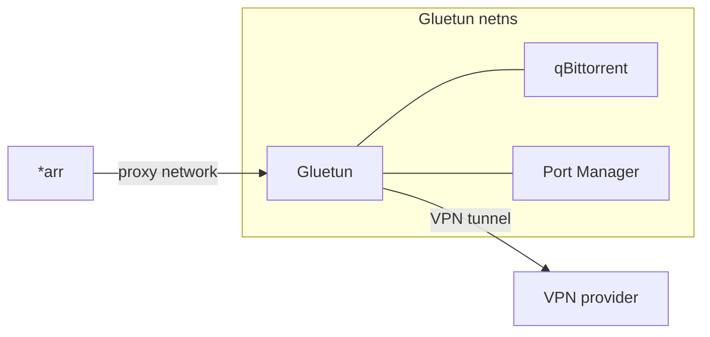

# Media Stack

VPN-gated torrent client and the *arr automation suite. See the main [README](../README.md) for the service overview.

## Network topology



qBittorrent and the port manager set `network_mode: service:gluetun`, sharing Gluetun's network namespace. Their entire traffic — torrent peers, trackers, WebUI requests — exits through the VPN tunnel. Other containers on the `proxy` Docker network reach qBittorrent's WebUI at `gluetun:8080`, since that port is bound on Gluetun's network interface.

## First-run configuration

### Gluetun

- Configured in `.env` via `VPN_SERVICE_PROVIDER`, `VPN_WIREGUARD_PRIVATE_KEY`, `VPN_WIREGUARD_ADDRESS`, `VPN_COUNTRY`.
- Port forwarding is enabled; the Gluetun Port Manager sidecar pushes the forwarded port to qBittorrent automatically.

### qBittorrent

- Default username: `admin`.
- First-run password is shown in the container logs:

  ```bash
  docker logs qbittorrent | grep -i password
  ```

- All torrent traffic routes through the VPN tunnel (network mode: `service:gluetun`).
- If the WebUI rejects requests when accessed through NPM with a host-header error, in Settings → WebUI either disable "Host header validation" or add the reverse-proxy domain to the whitelist.

### Prowlarr

- Add indexers (public or private).
- Sync indexers to Sonarr and Radarr from Prowlarr's UI (Settings → Apps).

### Sonarr

- Root folder: `/tv`.
- Download client: qBittorrent.

### Radarr

- Root folder: `/movies`.
- Download client: qBittorrent.

### Bazarr

- Connect to Sonarr and Radarr using their API keys (Bazarr → Settings → Sonarr/Radarr).

## Workflow

1. Gluetun establishes the VPN tunnel with port forwarding.
2. Gluetun Port Manager updates qBittorrent's listening port.
3. Prowlarr feeds indexers to Sonarr and Radarr.
4. Sonarr and Radarr send download requests to qBittorrent.
5. Bazarr fetches subtitles for managed media.
